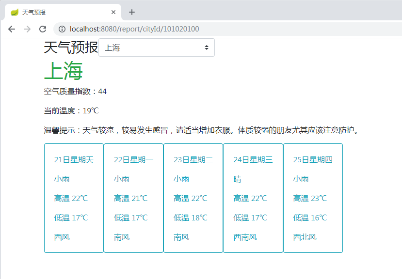

# 获取天气数据
### API
- 根据城市名字 `http://wthrcdn.etouch.cn/weather_mini?city=上海`
- 根据城市ID `http://wthrcdn.etouch.cn/weather_mini?citykey==101020100`

### 返回数据格式
```json
{
  "data": {
    "yesterday": {
      "date": "19日星期五",
      "high": "高温 21℃",
      "fx": "东风",
      "low": "低温 16℃",
      "fl": "<![CDATA[<3级]]>",
      "type": "多云"
    },
    "city": "上海",
    "aqi": "44",
    "forecast": [
      {
        "date": "20日星期六",
        "high": "高温 20℃",
        "fengli": "<![CDATA[<3级]]>",
        "low": "低温 16℃",
        "fengxiang": "西南风",
        "type": "多云"
      },
      {
        "date": "21日星期天",
        "high": "高温 22℃",
        "fengli": "<![CDATA[<3级]]>",
        "low": "低温 17℃",
        "fengxiang": "东风",
        "type": "多云"
      },
      {
        "date": "22日星期一",
        "high": "高温 21℃",
        "fengli": "<![CDATA[<3级]]>",
        "low": "低温 17℃",
        "fengxiang": "东北风",
        "type": "小雨"
      },
      {
        "date": "23日星期二",
        "high": "高温 22℃",
        "fengli": "<![CDATA[<3级]]>",
        "low": "低温 18℃",
        "fengxiang": "西南风",
        "type": "多云"
      },
      {
        "date": "24日星期三",
        "high": "高温 22℃",
        "fengli": "<![CDATA[<3级]]>",
        "low": "低温 17℃",
        "fengxiang": "西南风",
        "type": "晴"
      }
    ],
    "ganmao": "天气较凉，较易发生感冒，请适当增加衣服。体质较弱的朋友尤其应该注意防护。",
    "wendu": "19"
  },
  "status": 1000,
  "desc": "OK"
}
```

# 获取城市列表
### API 
`http://mobile.weather.com.cn/js/citylist.xml`
### 返回数据格式
返回的是XML数据，包括地名、编号。以上海城市为例，数据如下：
```xml
<?xml version="1.0" encoding="UTF-8"?>
<c c1="0">
    <d d1="101020100" d2="上海" d3="shanghai" d4="上海"/>
    <d d1="101020200" d2="闵行" d3="minhang" d4="上海"/>
    <d d1="101020300" d2="宝山" d3="baoshan" d4="上海"/>
    <d d1="101020500" d2="嘉定" d3="jiading" d4="上海"/>
    <d d1="101020600" d2="南汇" d3="nanhui" d4="上海"/>
    <d d1="101020700" d2="金山" d3="jinshan" d4="上海"/>
    <d d1="101020800" d2="青浦" d3="qingpu" d4="上海"/>
    <d d1="101020900" d2="松江" d3="songjiang" d4="上海"/>
    <d d1="101021000" d2="奉贤" d3="fengxian" d4="上海"/>
    <d d1="101021100" d2="崇明" d3="chongming" d4="上海"/>
    <d d1="101021200" d2="徐家汇" d3="xujiahui" d4="上海"/>
    <d d1="101021300" d2="浦东" d3="pudong" d4="上海"/>
</c>
```

# 项目API
- 根据城市名返回json `http://localhost:8080/weather/cityName/上海`
- 根据城市ID返回json `http://localhost:8080/weather/cityId/101020100`
- 前端访问项目 `http://localhost:8080/report/cityId/101020100`
    
    

